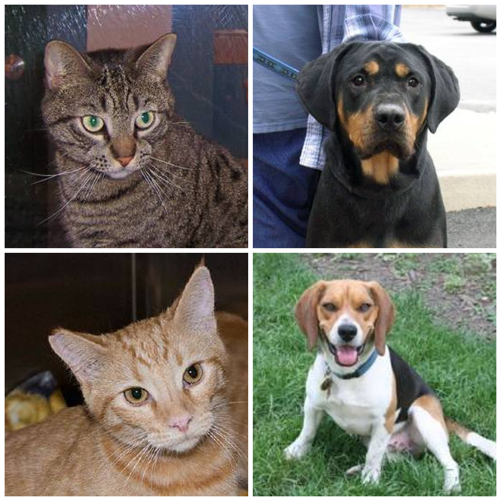
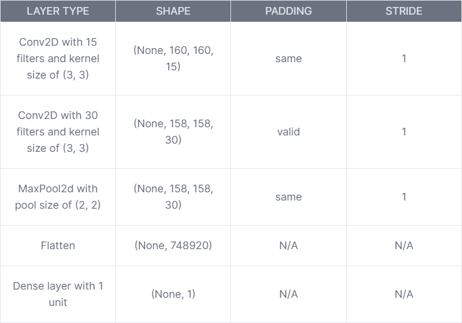
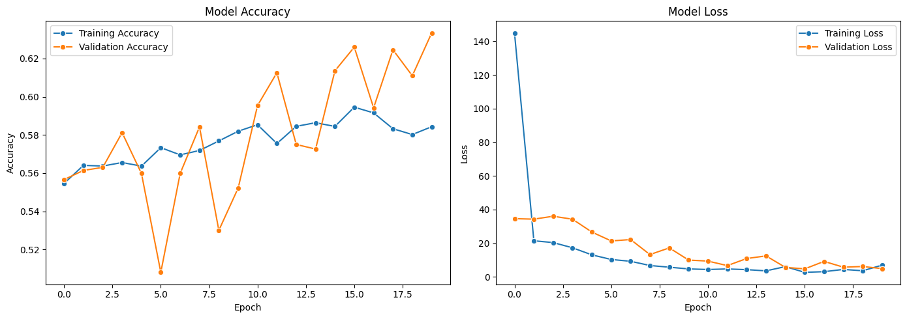
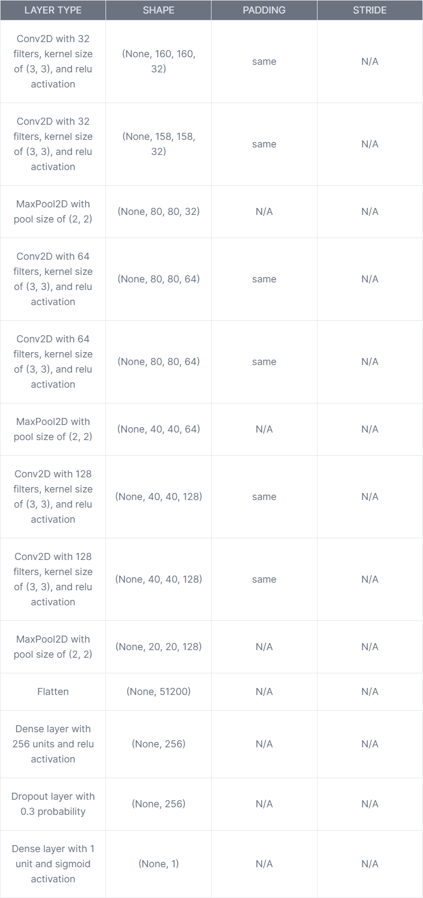
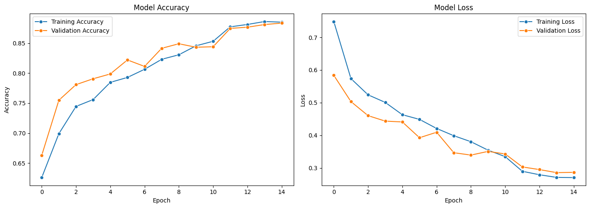
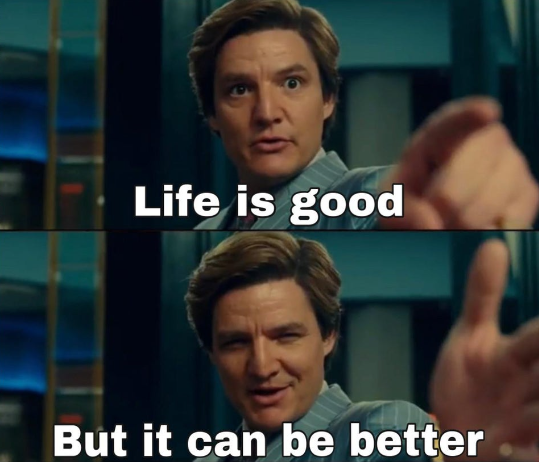
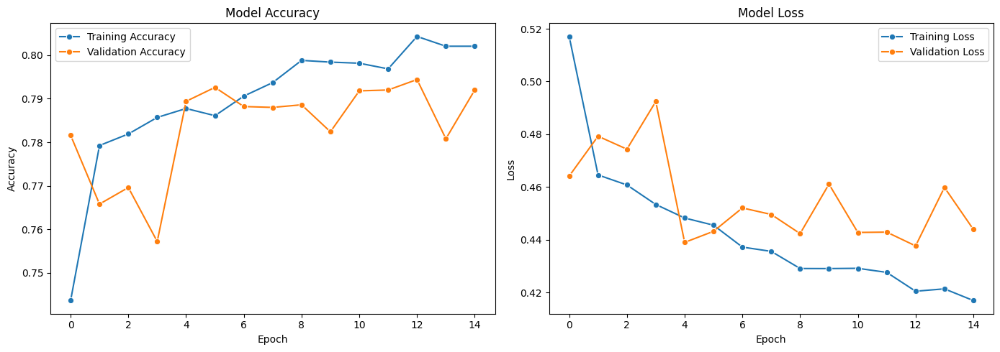
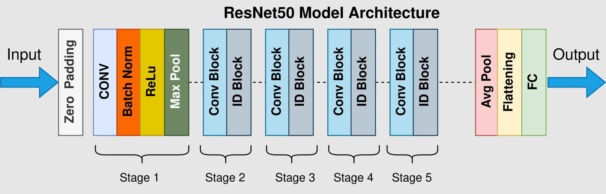
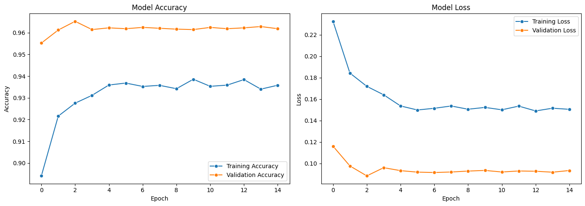
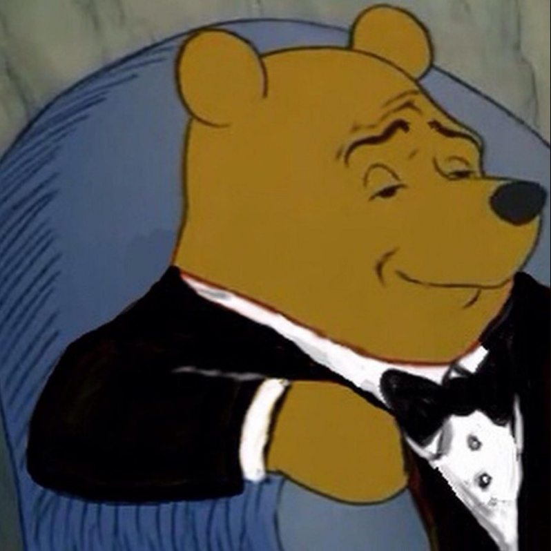

# Cats vs Dogs

This is my implementation of DL models on Cats vs dogs dataset.

## 1. Abstract

The cats and dogs dataset provides a starting point for someone just starting to explore CNNs. It is recommended to first get hands-on experience on a dataset which has 2 channels such as MNIST-784 or Fashion MNIST. The dataset contains RGB images of cats and dogs and the model aims to classify them with a reasonable accuracy and loss. As you read through this project, you will see a number of preprocessing techniques as well as several models tried on the dataset.

## 2. Dataset

The dataset can be found on kaggle: [Download Dataset](https://www.kaggle.com/c/dogs-vs-cats "Download Dataset").

>Extract the dataset in 'datasets/' directory to replicate

Some of the images from the dataset can be seen below:

## 3. Preprocessing

The dataset contains a total of **25000** images, **12500** images belonging to each of the **2** classes. Almost all of the images have different dimensions so I had to settle to a dimension which could fit for all. So I decided to go with the dimenstions of **(160, 160, 3)** which seemed like a reasonable fit for both the models parameters and image downscaling too. Initially the dataset looks big enough to train the model but its very small by the standards of CNNs because these type of neural networks require huge amounts of data to train something reasonable.

Naturally, I decided to apply some data augmentation using following techniques:

* Random flipping (horizontal)
* Random rotation (0.1)
* Random zooming (0.1)
* Random Translation (0.1, 0.1)

To import the dataset, it was not directly converted into RGB values, instead, I used the built-in method from Tensorflow to direcly import the dataset.The code is below. This method provides the functionality to create training set and validation set directly from dataset directory.The batch size of Batch Gradient Descent was set to 32 to easily fit in the memory.

`tensorflow.keras.preprocessing.image_dataset_from_directory`

## 4. Basic model

For initial reference point , I decided to train a simple model which will provide us with the further directions. The model's architecture is as follows:

The model was compiled with following parameters:

* **Loss**: Binary Crossentropy
* **Optimizer**: Adam optimizer with learning rate set to: 0.001
* **Epochs**: 20

The model performed very bad (as expected), but at least it gave me a direction. Following chart shows model's performance and loss over the epochs:

Model's performance and loss are as follows:

Dataset     | Accuracy  | Loss
----------  | ---------  | --------
Training     | 58.43%    | 6.94
Validation  | 63.34%    | 4.87

The model was underfitting on both datasets so it meant we needed a more complex model at this point.

## 5. Complex custom made model

After fiddling around for some time I came up with the following model:

This time the model was trained with Learning rate scheduler which is provided built-in Tensorflow. **Initial learning rate** was set to 0.0001. Following is the code to implement LR Scheduling:

    reduce_lr = ReduceLROnPlateau(
        monitor='val_loss',
        factor=0.1,
        patience=1,
        min_lr=1e-6,
        verbose=1)
    model_v2.compile(optimizer=Adam(learning_rate=0.0003),
        loss='binary_crossentropy',
        metrics=['accuracy'])

Performance on this model was much better than the basic model.

Model's performance and loss are as follows:

Dataset     | Accuracy  | Loss
----------  | ---------  | --------
Training     | 88.5%    | 0.27
Validation  | 88.3%    | 0.28

The model performed better than our basic model but it still wasn't enough. Here, I wanted to explore more robust and ready-to-use options.

## 6. MobileNet2

MobileNet2 is a pretrained model and it is widely used for image classification tasks. I decided to use this model. Following are the modifications made:

* Froze the entire model and made it untrainable
* Added a Dense layer with **128** units and 'relu' activation
* Added a Dense layer with **1** unit and 'sigmoid' activation

This model was also trained with Learning rate scheduler. Here are the results:

Dataset     | Accuracy  | Loss
----------  | ---------  | --------
Training     | 80.2%    | 0.41
Validation  | 79.2%    | 0.44

What happened here?!

It seems like MobileNet2 isn't complex enough to capture the details in this dataset. So, it was time to try something else.

## 7. ResNet50

My next choice of model was ResNet50. Reason behind choosing this model is that it is complex enough to capture details in the images, and it uses residual blocks instead of plain Neural Networks which give a huge overhead in model training. A simplified depiction of the model:

Following are the modifications I made to this model:

* Froze the entire model and made it untrainable
* Added a Global average pooling layer
* Added a dropout layer with probability of 0.2
* Added a Dense layer with **128** units and 'relu' activation
* Added a Dense layer with **1** unit and 'sigmoid' activation

This model was also trained using Learning rate scheduler mentioned above. Here are the results of this model:

Dataset     | Accuracy  | Loss
----------  | ---------  | --------
Training     | 93.5%    | 0.15
Validation  | 96.1%    | 0.09

At last I had a pretty decent model with high train and validation accuracy. I was happy with this model and decided to wrap it up here.
